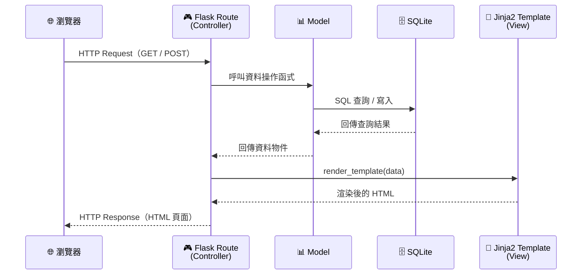
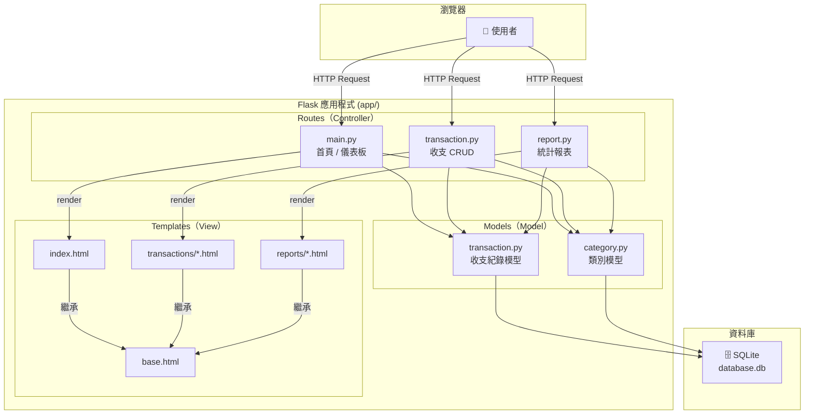

# 系統架構文件 — 個人記帳簿系統

---

## 1. 技術架構說明

### 1.1 選用技術與原因

| 技術 | 用途 | 選用原因 |
|------|------|----------|
| **Python** | 程式語言 | 語法簡潔易學，適合快速開發 Web 應用 |
| **Flask** | 後端框架 | 輕量級微框架，彈性高，學習曲線低，適合中小型專案 |
| **Jinja2** | 模板引擎 | Flask 內建支援，可直接在 HTML 中嵌入 Python 邏輯，自動轉義防 XSS |
| **SQLite** | 資料庫 | 不需額外安裝資料庫伺服器，單檔案即可運作，適合個人應用 |
| **HTML + CSS + JS** | 前端 | 標準 Web 技術，搭配 Jinja2 渲染，無需前後端分離 |

### 1.2 Flask MVC 模式說明

本專案採用 **MVC（Model–View–Controller）** 架構模式來組織程式碼：

```
┌─────────────────────────────────────────────────────────────┐
│                        瀏覽器 (Browser)                      │
│                    使用者透過瀏覽器操作系統                     │
└──────────────┬──────────────────────────────┬────────────────┘
               │ HTTP Request                 ▲ HTTP Response
               ▼                              │
┌──────────────────────────────────────────────────────────────┐
│                   Controller（Flask Routes）                  │
│                      app/routes/*.py                         │
│                                                              │
│  • 接收使用者的 HTTP 請求（GET / POST）                         │
│  • 呼叫 Model 進行資料處理                                     │
│  • 將結果傳遞給 View（模板）渲染                                │
│  • 回傳 HTML 頁面給瀏覽器                                      │
└──────────┬──────────────────────────────┬────────────────────┘
           │ 呼叫 Model                    │ 傳資料給 Template
           ▼                              ▼
┌────────────────────────┐  ┌──────────────────────────────────┐
│   Model（資料模型）      │  │      View（Jinja2 模板）          │
│   app/models/*.py      │  │      app/templates/*.html        │
│                        │  │                                  │
│ • 定義資料結構           │  │ • 定義 HTML 頁面結構              │
│ • 封裝資料庫 CRUD 操作   │  │ • 使用 Jinja2 語法顯示動態資料    │
│ • 處理商業邏輯           │  │ • 包含表單供使用者輸入            │
└──────────┬─────────────┘  └──────────────────────────────────┘
           │ SQL 查詢
           ▼
┌────────────────────────┐
│   SQLite Database      │
│   instance/database.db │
│                        │
│ • 儲存所有收支紀錄       │
│ • 儲存類別資料           │
└────────────────────────┘
```

---

## 2. 專案資料夾結構

```
web_app_development/
│
├── app.py                      ← 🚀 應用程式入口，啟動 Flask 伺服器
├── config.py                   ← ⚙️ 設定檔（資料庫路徑、SECRET_KEY 等）
├── requirements.txt            ← 📦 Python 套件清單
│
├── app/                        ← 📁 主要應用程式目錄
│   ├── __init__.py             ← 🏭 Flask App 工廠函式（create_app）
│   │
│   ├── models/                 ← 📊 Model 層：資料庫模型與操作
│   │   ├── __init__.py
│   │   ├── transaction.py      ← 收支紀錄模型（新增/查詢/修改/刪除）
│   │   └── category.py         ← 類別模型（收入類別/支出類別）
│   │
│   ├── routes/                 ← 🎮 Controller 層：Flask 路由
│   │   ├── __init__.py
│   │   ├── main.py             ← 首頁路由（儀表板、餘額顯示）
│   │   ├── transaction.py      ← 收支紀錄 CRUD 路由
│   │   └── report.py           ← 統計報表路由（類別統計、月度統計）
│   │
│   ├── templates/              ← 🎨 View 層：Jinja2 HTML 模板
│   │   ├── base.html           ← 基底模板（共用 header / footer / nav）
│   │   ├── index.html          ← 首頁（儀表板：餘額總覽）
│   │   ├── transactions/
│   │   │   ├── list.html       ← 收支紀錄列表頁
│   │   │   ├── create.html     ← 新增收支紀錄頁
│   │   │   └── edit.html       ← 編輯收支紀錄頁
│   │   └── reports/
│   │       ├── category.html   ← 類別統計頁
│   │       └── monthly.html    ← 月度統計頁
│   │
│   └── static/                 ← 📂 靜態資源
│       ├── css/
│       │   └── style.css       ← 全站樣式
│       └── js/
│           └── main.js         ← 前端互動邏輯
│
├── instance/                   ← 🗄️ 執行時期資料（不納入版控）
│   └── database.db             ← SQLite 資料庫檔案
│
└── docs/                       ← 📝 專案文件
    ├── PRD.md                  ← 產品需求文件
    └── ARCHITECTURE.md         ← 系統架構文件（本文件）
```

### 各資料夾 / 檔案職責說明

| 路徑 | 說明 |
|------|------|
| `app.py` | 應用程式入口。執行 `python app.py` 即可啟動開發伺服器 |
| `config.py` | 集中管理設定（SECRET_KEY、資料庫路徑、DEBUG 模式等） |
| `requirements.txt` | 列出所有 Python 套件依賴，方便 `pip install -r requirements.txt` 安裝 |
| `app/__init__.py` | 定義 `create_app()` 工廠函式，初始化 Flask App、註冊 Blueprint、建立資料庫 |
| `app/models/` | 資料模型層，封裝所有資料庫操作（CRUD），不直接處理 HTTP 請求 |
| `app/routes/` | 路由控制層，接收 HTTP 請求，呼叫 Model 取得資料，再交由模板渲染 |
| `app/templates/` | Jinja2 模板，定義 HTML 頁面結構，使用模板繼承減少重複程式碼 |
| `app/static/` | 靜態資源（CSS、JavaScript），由瀏覽器直接請求載入 |
| `instance/` | 存放 SQLite 資料庫，此目錄不應納入 Git 版控 |
| `docs/` | 專案設計文件（PRD、架構文件等） |

---

## 3. 元件關係圖

### 3.1 請求處理流程（Mermaid）



### 3.2 系統模組關係圖（Mermaid）



### 3.3 功能對應模組表

| 功能編號 | 功能名稱 | Route | Model | Template |
|----------|----------|-------|-------|----------|
| F1 | 紀錄收入 | `transaction.py` | `transaction.py` | `create.html` |
| F2 | 紀錄支出 | `transaction.py` | `transaction.py` | `create.html` |
| F3 | 計算餘額並顯示 | `main.py` | `transaction.py` | `index.html` |
| F4 | 計算每個種類花費 | `report.py` | `transaction.py`, `category.py` | `category.html` |
| F5 | 統計每月花費 | `report.py` | `transaction.py` | `monthly.html` |
| F6 | 收支紀錄列表 | `transaction.py` | `transaction.py` | `list.html` |
| F7 | 編輯 / 刪除紀錄 | `transaction.py` | `transaction.py` | `edit.html` |

---

## 4. 關鍵設計決策

### 決策 1：使用 Application Factory 模式（`create_app()`）

**決策**：在 `app/__init__.py` 中使用工廠函式 `create_app()` 來建立 Flask 應用程式實例。

**原因**：
- 避免循環匯入（circular import）問題
- 方便日後撰寫測試時建立不同設定的 App 實例
- 是 Flask 官方推薦的最佳實踐

---

### 決策 2：使用 Blueprint 組織路由

**決策**：將路由拆分為多個 Blueprint（`main`、`transaction`、`report`），而非全部寫在同一個檔案。

**原因**：
- 避免單一檔案過於龐大，提高可維護性
- 各模組職責分明，方便多人協作開發
- Blueprint 可以設定自己的 URL 前綴（如 `/transactions/`、`/reports/`）

---

### 決策 3：收入與支出使用同一張資料表

**決策**：收入與支出紀錄儲存在同一張 `transactions` 資料表中，透過 `type` 欄位（`income` / `expense`）區分。

**原因**：
- 簡化資料結構，減少資料表數量
- 計算餘額時只需對同一張表做 SUM，不需跨表查詢
- 列表顯示時可統一排序，使用者體驗更一致

---

### 決策 4：類別採用預設 + 固定方式

**決策**：系統預設提供收入類別（5 種）和支出類別（9 種），存放在 `categories` 資料表中，初始化時自動寫入。

**原因**：
- MVP 階段減少開發複雜度，不需實作類別管理 CRUD
- 預設類別涵蓋大多數日常使用情境
- 未來可擴充讓使用者自訂類別

---

### 決策 5：統計計算在伺服器端完成

**決策**：所有統計（餘額、類別統計、月度統計）均由 Flask 後端的 SQL 查詢完成，而非在前端用 JavaScript 計算。

**原因**：
- SQLite 的聚合函式（SUM、GROUP BY）效能優良
- 減少前端資料傳輸量，只傳送計算後的結果
- 確保統計數據的一致性與正確性

---

> 📌 **文件版本**：v1.0  
> 📅 **建立日期**：2026-04-16  
> ✏️ **最後更新**：2026-04-16
