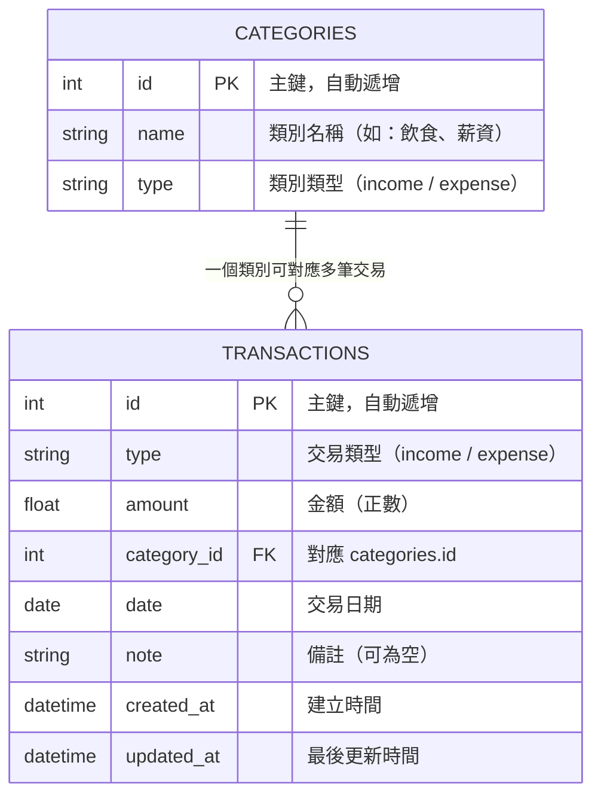

# 資料庫設計文件 — 個人記帳簿系統

---

## 1. ER 圖（實體關係圖）

### 關聯說明

| 關聯 | 類型 | 說明 |
|------|------|------|
| `CATEGORIES` → `TRANSACTIONS` | 一對多（1:N） | 一個類別可以有多筆收支紀錄，一筆紀錄只屬於一個類別 |

---

## 2. 資料表詳細說明

### 2.1 categories（類別表）

儲存收入與支出的分類，系統初始化時自動寫入預設類別。

| 欄位名稱 | 資料型別 | 必填 | 預設值 | 說明 |
|----------|----------|------|--------|------|
| `id` | INTEGER | ✅ | 自動遞增 | 主鍵（Primary Key） |
| `name` | TEXT | ✅ | — | 類別名稱（如：飲食、薪資） |
| `type` | TEXT | ✅ | — | 類別類型，`income`（收入）或 `expense`（支出） |

**約束條件**：
- `id`：主鍵，自動遞增
- `name`：不可為 NULL
- `type`：不可為 NULL，值必須為 `income` 或 `expense`

---

### 2.2 transactions（交易紀錄表）

儲存每一筆收入或支出的詳細資料。

| 欄位名稱 | 資料型別 | 必填 | 預設值 | 說明 |
|----------|----------|------|--------|------|
| `id` | INTEGER | ✅ | 自動遞增 | 主鍵（Primary Key） |
| `type` | TEXT | ✅ | — | 交易類型，`income`（收入）或 `expense`（支出） |
| `amount` | REAL | ✅ | — | 金額，必須為正數 |
| `category_id` | INTEGER | ✅ | — | 外鍵，對應 `categories.id` |
| `date` | TEXT | ✅ | — | 交易日期，格式 `YYYY-MM-DD` |
| `note` | TEXT | ❌ | `''` | 備註說明 |
| `created_at` | TEXT | ✅ | 當前時間 | 紀錄建立時間，ISO 8601 格式 |
| `updated_at` | TEXT | ✅ | 當前時間 | 最後更新時間，ISO 8601 格式 |

**約束條件**：
- `id`：主鍵，自動遞增
- `type`：不可為 NULL，值必須為 `income` 或 `expense`
- `amount`：不可為 NULL，必須大於 0
- `category_id`：外鍵，參照 `categories(id)`
- `date`：不可為 NULL

**索引**：
- `idx_transactions_date`：加速依日期排序與篩選
- `idx_transactions_type`：加速按類型篩選
- `idx_transactions_category_id`：加速類別統計查詢

---

## 3. 預設類別資料

### 收入類別

| id | name | type |
|----|------|------|
| 1 | 薪資 | income |
| 2 | 獎金 | income |
| 3 | 投資收益 | income |
| 4 | 兼職 | income |
| 5 | 其他收入 | income |

### 支出類別

| id | name | type |
|----|------|------|
| 6 | 飲食 | expense |
| 7 | 交通 | expense |
| 8 | 住宿 | expense |
| 9 | 娛樂 | expense |
| 10 | 購物 | expense |
| 11 | 醫療 | expense |
| 12 | 教育 | expense |
| 13 | 日用品 | expense |
| 14 | 其他支出 | expense |

---

> 📌 **文件版本**：v1.0  
> 📅 **建立日期**：2026-04-16  
> ✏️ **最後更新**：2026-04-16
