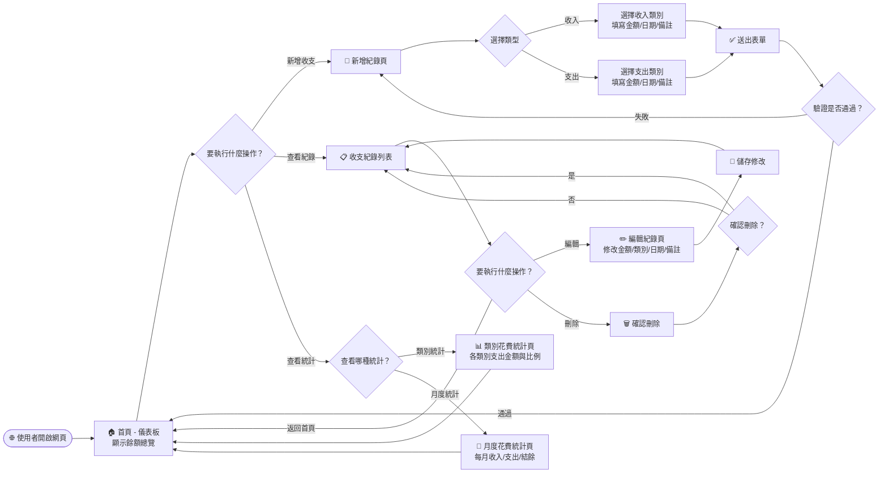
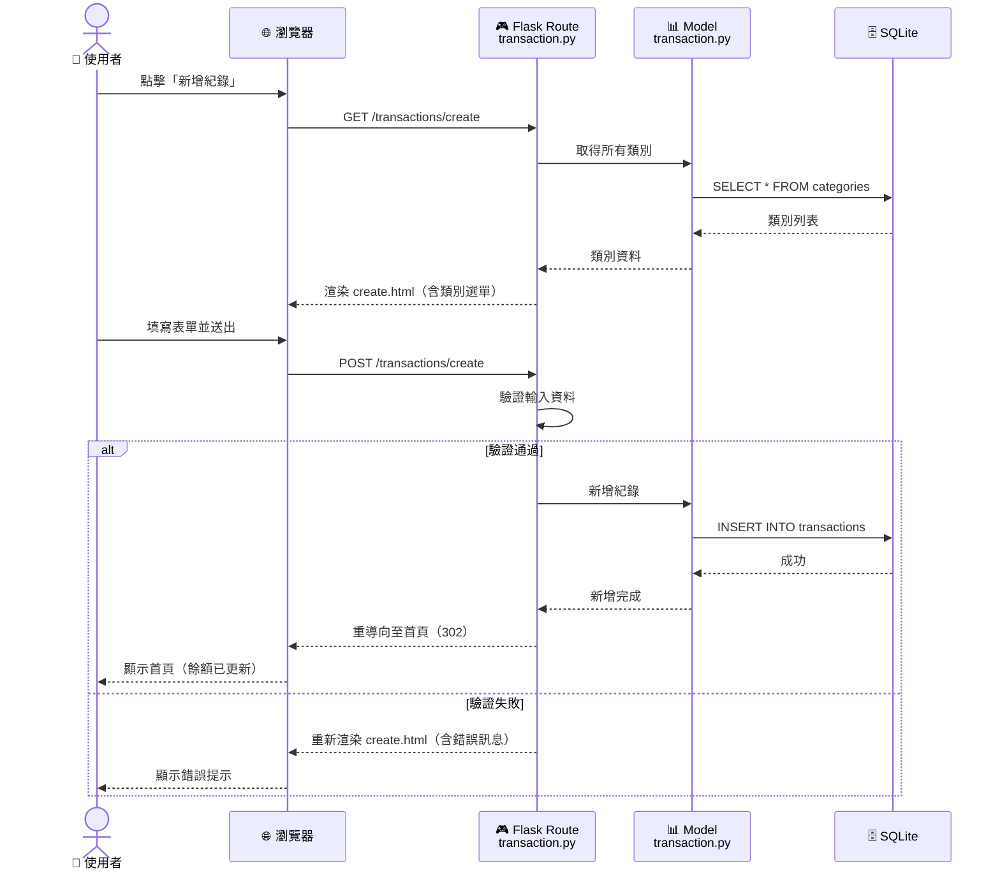
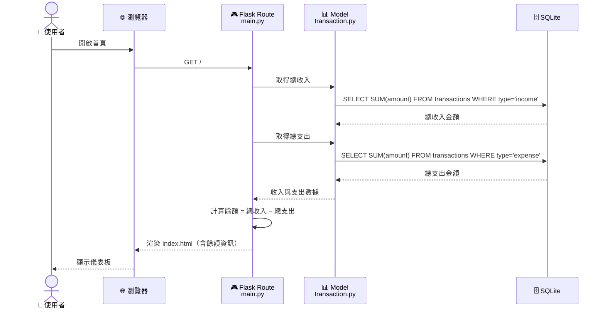
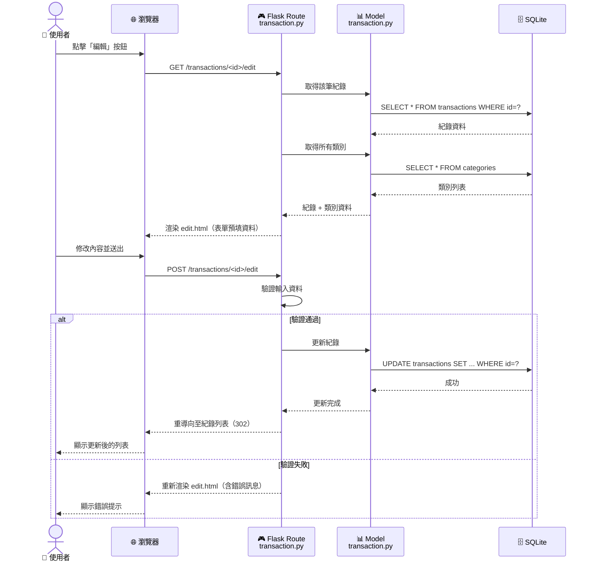
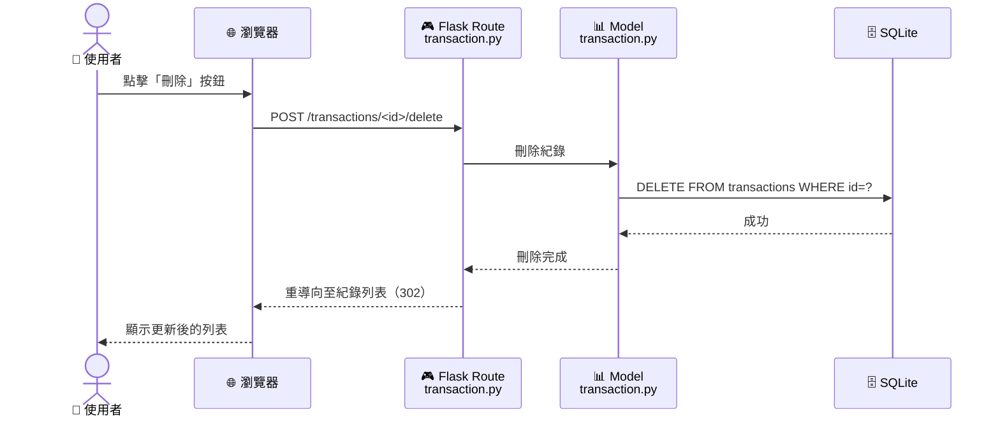
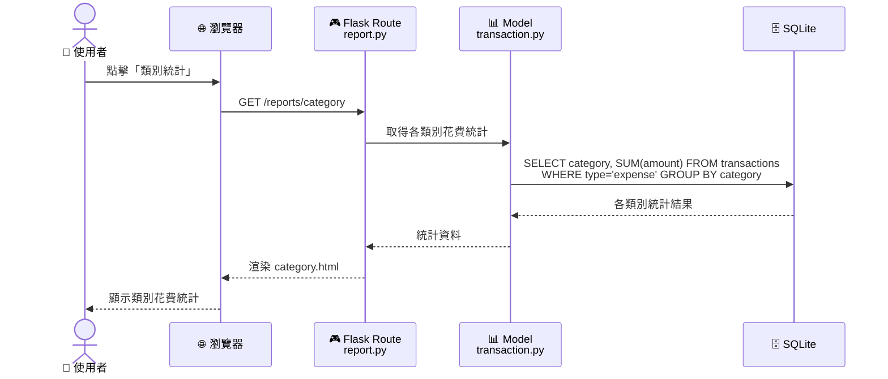
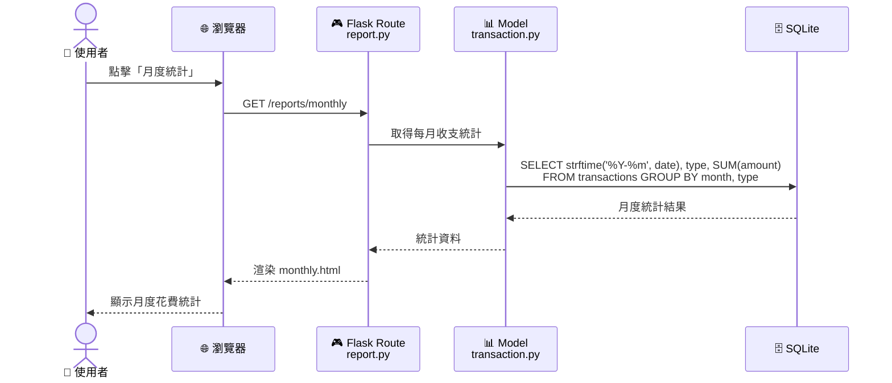

# 流程圖文件 — 個人記帳簿系統

---

## 1. 使用者流程圖（User Flow）

以下流程圖描述使用者從進入網站到完成各項操作的完整路徑。

### 流程說明

| 步驟 | 說明 |
|------|------|
| **進入首頁** | 使用者開啟網頁後，首頁顯示總收入、總支出與目前餘額 |
| **新增收支** | 選擇收入或支出，填寫類別、金額、日期與備註後送出 |
| **查看紀錄** | 瀏覽所有收支紀錄列表，可進一步編輯或刪除 |
| **編輯紀錄** | 修改已存在的收支紀錄內容，儲存後返回列表 |
| **刪除紀錄** | 點擊刪除後需確認，確認後從列表移除 |
| **類別統計** | 查看各類別的支出金額彙整 |
| **月度統計** | 查看每月的收入、支出與結餘變化 |

---

## 2. 系統序列圖（Sequence Diagram）

### 2.1 新增收支紀錄

描述使用者新增一筆收支紀錄時，資料從瀏覽器到資料庫的完整流程。

### 2.2 查看首頁餘額

描述使用者進入首頁時，系統如何計算並顯示餘額。

### 2.3 編輯收支紀錄

### 2.4 刪除收支紀錄

### 2.5 類別統計

### 2.6 月度統計

---

## 3. 功能清單對照表

| 功能編號 | 功能名稱 | URL 路徑 | HTTP 方法 | 說明 |
|----------|----------|----------|-----------|------|
| F3 | 首頁儀表板 | `/` | `GET` | 顯示總收入、總支出、目前餘額 |
| F1, F2 | 新增紀錄頁面 | `/transactions/create` | `GET` | 顯示新增收支紀錄表單 |
| F1, F2 | 新增紀錄送出 | `/transactions/create` | `POST` | 處理表單送出，寫入資料庫 |
| F6 | 收支紀錄列表 | `/transactions` | `GET` | 顯示所有收支紀錄，依日期排序 |
| F7 | 編輯紀錄頁面 | `/transactions/<id>/edit` | `GET` | 顯示編輯表單，預填現有資料 |
| F7 | 編輯紀錄送出 | `/transactions/<id>/edit` | `POST` | 處理編輯表單送出，更新資料庫 |
| F7 | 刪除紀錄 | `/transactions/<id>/delete` | `POST` | 刪除指定紀錄 |
| F4 | 類別統計 | `/reports/category` | `GET` | 顯示各類別支出金額統計 |
| F5 | 月度統計 | `/reports/monthly` | `GET` | 顯示每月收入、支出與結餘 |

---

> 📌 **文件版本**：v1.0  
> 📅 **建立日期**：2026-04-16  
> ✏️ **最後更新**：2026-04-16
